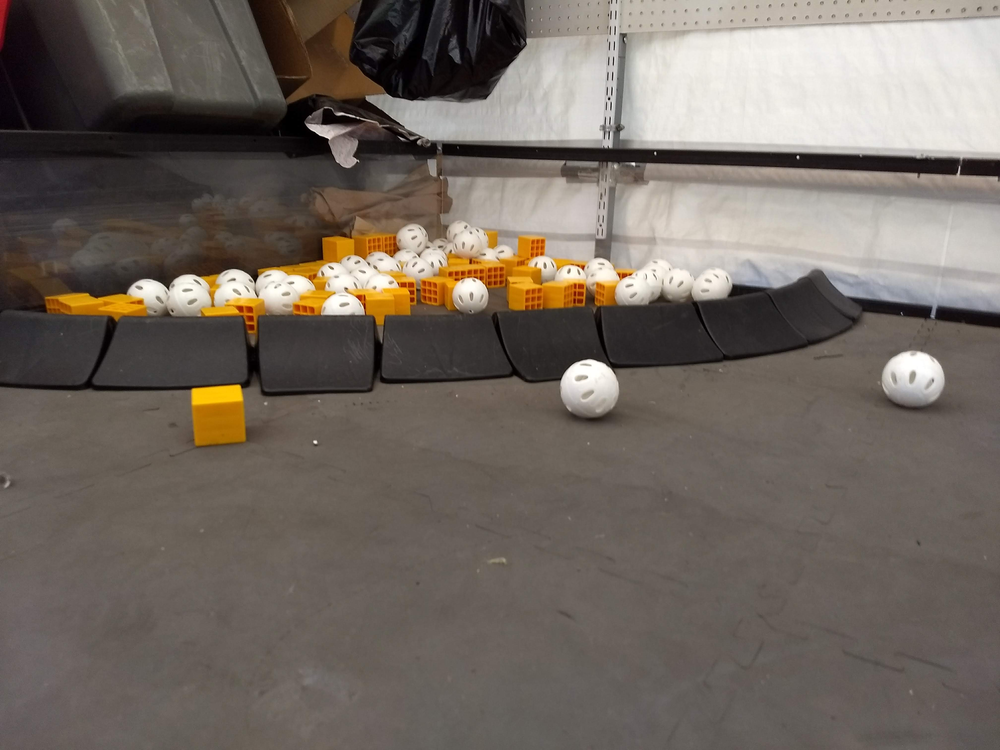
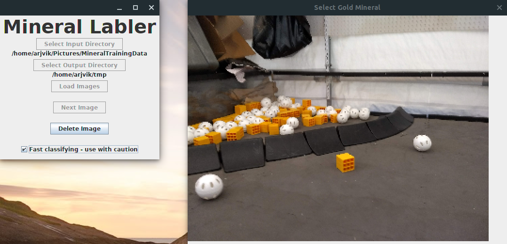

# MineralLabler
A tool for labling training data for training a CNN for this year's FTC game. [Download latest version](https://github.com/arjvik/MineralLabler/releases/download/v1.0/MineralLabler.jar)

## Getting Started
 1. Take photos of minerals. Take as many photos as you can! The more, the merrier.
    
 2. Place these photos in a folder **without any other files**. Create another **empty** folder for the outputted labled photos.
 3. Launch the app. Select the input folder and the output folder you created earlier.
    
 4. Click Load Images.
 5. If you have many images, you may want to select the Fast Classifying option. This means that you will not be able to change your label after you select it, but it saves you the time it takes to move your mouse to click Next Image.
 6. For each image, click on the gold mineral in the photo. **Only click on the one in the sampling row.** If Fast Classifying is off, click the Next button after you are happy with your selection.
 7. If you do not want to use the image you are on (it is too blurry or there is something obstructing the photo), click the Delete Image button.
 8. When you are done, open your output folder. Voila! You have all your labled images!

## Contributing
Send a PR to this repository, or add issues to it.
